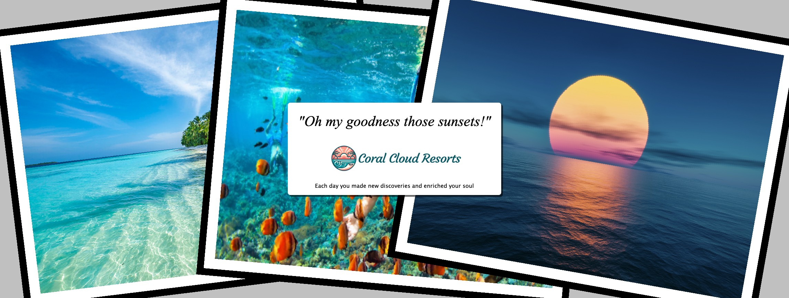

Extending the Coral Cloud Agent with Heroku
===========================================

This demo extends the popular Coral Cloud demo by extending the Coral Cloud Agent with the ability to dynamically generate a custom collage of the guests stay. You can watch a short demo video [here](https://drive.google.com/file/d/1L2BjRLBbCSJlohd60oaqo73Iv_O6euhi/view?usp=sharing). Finally, you can also learn more by taking look at our first Agentforce demo [here](https://blog.heroku.com/building-supercharged-agents-heroku-agentforce)

Basic Deploy Instructions
-------------------------
- Deploy the [Coral Cloud sample](https://developer.salesforce.com/sample-apps), including the service extensisons that include a Experience Cloud site
- Deploy as you would any other Heroku Java application
- Connect the Heroku app via Heorku Connect to your demo org
- Configure the Agentforce Action and add it to the Coral Cloud Agent

Detailed Deploy Instructions
----------------------------
- Coming soon, please reachout to afawcett@salesforce.com if you need help sooner.
